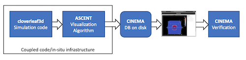
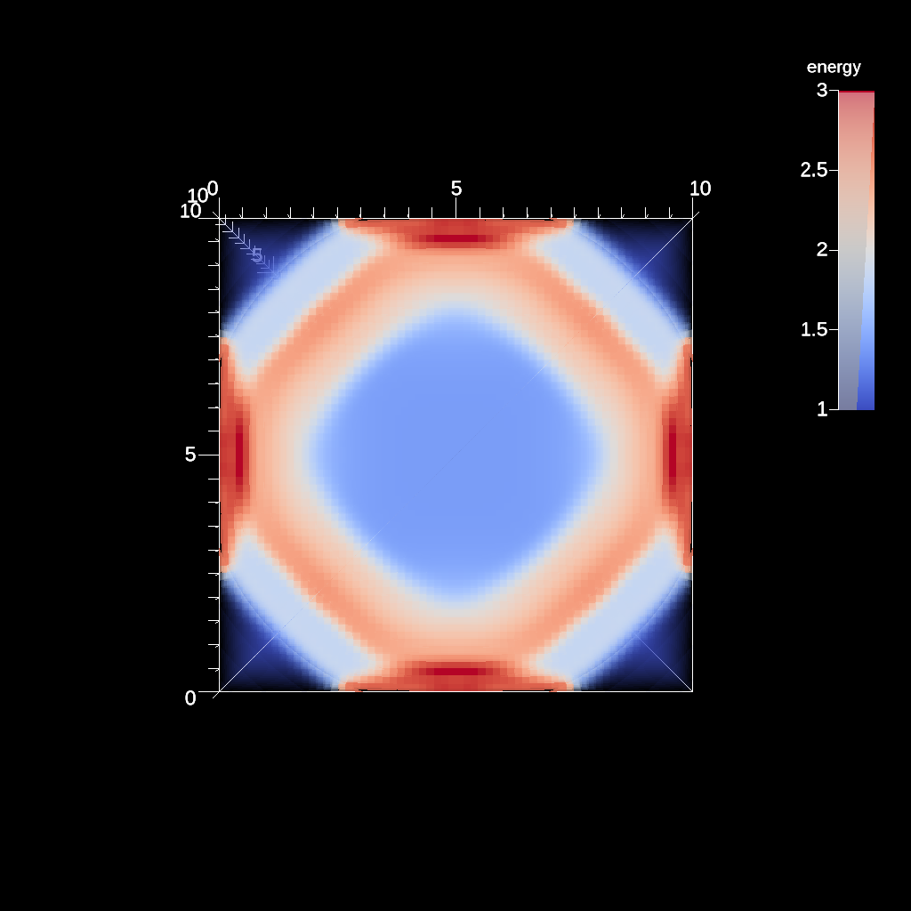

# Cinema E4S Tutorial Repository 

Diagram of workflow in this example.

A repository for a tutorial for Pantheon workflows. This example uses `Ascent`, in-situ creation of `Cinema`
databases, and post-processing analysis. 

Build instructions embedded in this workflow are derived from the Ascent build instructions [here](https://ascent.readthedocs.io/en/latest/BuildingAscent.html). This workflow uses **spack** to build all executables, from a specific commit.

This workflow is based on one that will pull cached builds from 
a [E4S](https://e4s-project.github.io/) repository, if they exist
to speed up the build/install of requisite applications. If no cached builds are available, it will use
[spack](https://github.com/spack/spack) to build applications.

This tutorial workflow was designed to work on a virtual machine, so it differs from the original workflow.

For complete instructions, see documents beginning in `doc/tutorial/index.html` 

<table>
<tr>
<td>
<td>
<td>
</tr>
</table>

Images from the resulting Cinema database (used to validate run)

<small>LA-UR-21-23407</small>

